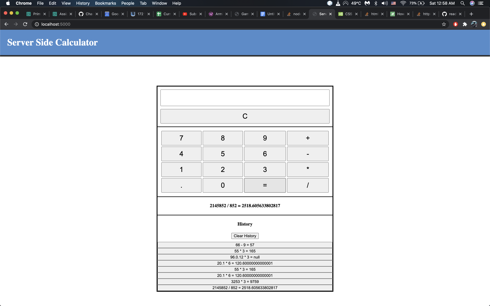

Duration: 10 hours

This is a fully functional visual calculator, where all of the math is done server side.

Prerequisites

Node
Express
Heroku

Installation

npm i

How does someone use this application? Tell a user story here.

1. Input a value,
2. Select what type of equation you would like to do,
3. Input a second value
4. Click on equals to get a result
5. [C] will clear the field
6. Clicking on a equation in the history list will repopulate it in the calculator
7. [Clear History] button will clear all history

License
MIT

Note, include this only if you have a license file. GitHub will generate one for you if you want!

Acknowledgement
Thanks to Prime Digital Academy who equipped and helped me to make this application a reality. (Thank your people)

Support
If you have suggestions or issues, please email me at csim6890@gmail.com
